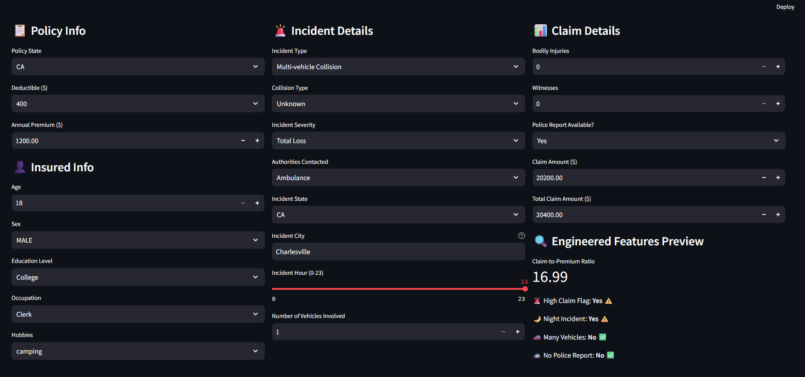
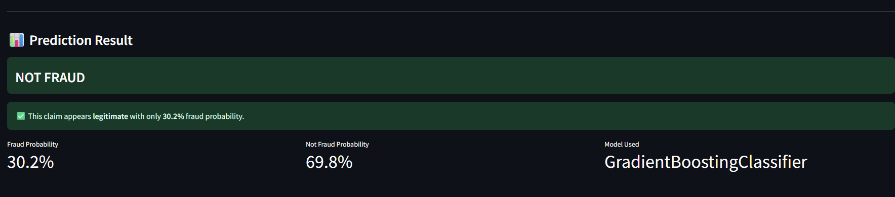

<div align="center">

# Vehicle Insurance Claim Fraud Detection

[](https://www.python.org/)
[](https://scikit-learn.org/)
[](https://fastapi.tiangolo.com/)
[](https://streamlit.io/)
[](https://pandas.pydata.org/)
[](https://numpy.org/)

[](LICENSE)


**An end-to-end Machine Learning system that detects fraudulent vehicle insurance claims**  
**with a FastAPI backend and Streamlit dashboard.**

---

[Key Features](#key-features) •
[Screenshots](#screenshots) •
[Model Performance](#model-performance) •
[Quick Start](#quick-start) •
[API Reference](#api-reference) •
[Project Structure](#project-structure)

</div>

---

<a id="key-features"></a>

## Key Features

- **End-to-End ML Pipeline** — From raw data to deployed prediction service, covering EDA, preprocessing, feature engineering, training, evaluation, and deployment.
- **8 Classification Models Compared** — Logistic Regression, Naive Bayes, KNN, SVM, Decision Tree, Random Forest, Gradient Boosting, and AdaBoost — all benchmarked on the same test set.
- **Hyperparameter Tuning** — RandomizedSearchCV on the best model (Gradient Boosting) with 20 iterations across 5 hyperparameters.
- **5 Domain-Engineered Features** — Claim-to-premium ratio, high claim flag, night incident indicator, multi-vehicle flag, and missing police report flag.
- **REST API with FastAPI** — Production-ready prediction endpoint with input validation, error handling, and auto-generated Swagger docs.
- **Interactive Streamlit Dashboard** — User-friendly interface with real-time engineered feature preview and clear fraud/legitimate result display.
- **Class Imbalance Handling** — Balanced class weights and ROC-AUC as the primary evaluation metric (not accuracy) for the 88.5% / 11.5% imbalanced dataset.

---

<a id="screenshots"></a>

## Screenshots

### Input Form
The dashboard provides a 3-column layout for entering policy info, incident details, and claim amounts. Engineered features are previewed in real-time before prediction.

<div align="center">

</div>

---

### Prediction Results
The system clearly displays fraud/legitimate verdicts with probability scores and the model used.

<div align="center">

</div>

---

<a id="model-performance"></a>

## Model Performance

All models were evaluated on a held-out 20% test set (stratified split) with 5-fold cross-validation.

| Model | Accuracy | ROC-AUC | F1 (Fraud) | Recall (Fraud) | Precision (Fraud) |
|:------|:--------:|:-------:|:----------:|:--------------:|:-----------------:|
| **Gradient Boosting (Tuned)** | **0.8817** | **0.7235** | **0.0247** | **0.0131** | **0.2250** |
| Random Forest | 0.8227 | 0.7111 | 0.3440 | 0.4055 | 0.2987 |
| Decision Tree | 0.6387 | 0.6952 | 0.2910 | 0.6468 | 0.1878 |
| AdaBoost | 0.8845 | 0.6842 | 0.0000 | 0.0000 | 0.0000 |
| SVM | 0.6758 | 0.6553 | 0.2602 | 0.4971 | 0.1762 |
| Naive Bayes | 0.8853 | 0.6483 | 0.0000 | 0.0000 | 0.0000 |
| Logistic Regression | 0.5900 | 0.6342 | 0.2491 | 0.5930 | 0.1577 |
| KNN | 0.8772 | 0.5474 | 0.0264 | 0.0145 | 0.1449 |

> **Why ROC-AUC?** With 88.5% of claims being legitimate, accuracy is misleading — a naive "always predict Not Fraud" model scores 88.5%. ROC-AUC properly measures the model's ability to distinguish between classes regardless of threshold.

> **Why Gradient Boosting?** Highest ROC-AUC, stable cross-validation performance, and sequential boosting naturally focuses on hard-to-classify (fraudulent) samples.

---

<a id="quick-start"></a>

## Quick Start

### Prerequisites
- Python 3.10+
- pip

### 1. Clone the Repository
```bash
git clone https://github.com/ahmedsa12/Vehicle-Insurance-Fraud-Detection.git
cd Vehicle-Insurance-Fraud-Detection
```

### 2. Run the Notebook
Open `notebook/Vehicle_Insurance_Fraud_Detection.ipynb` in **Google Colab** or **Jupyter Notebook** and run all cells. This will:
- Perform EDA and preprocessing
- Train 8 models with hyperparameter tuning
- Save model artifacts to the `model/` folder

### 3. Start the FastAPI Backend
```bash
cd api
pip install -r requirements.txt
uvicorn fastapi_main:app --reload --port 8000
```
API docs available at: [http://127.0.0.1:8000/docs](http://127.0.0.1:8000/docs)

### 4. Start the Streamlit Frontend
```bash
cd streamlit
pip install -r requirements.txt
streamlit run streamlit_app.py
```
Open [http://localhost:8501](http://localhost:8501) in your browser.

---

<a id="api-reference"></a>

## API Reference

### `POST /predict`
Submit claim details and receive a fraud prediction.

**Example Request:**
```bash
curl -X POST "http://127.0.0.1:8000/predict" \
  -H "Content-Type: application/json" \
  -d '{
    "policy_state": "CA",
    "policy_deductible": 500,
    "policy_annual_premium": 1200.0,
    "insured_age": 35,
    "insured_sex": "MALE",
    "insured_education_level": "College",
    "insured_occupation": "Manager",
    "insured_hobbies": "reading",
    "incident_type": "Single Vehicle Collision",
    "collision_type": "Front",
    "incident_severity": "Major Damage",
    "authorities_contacted": "Police",
    "incident_state": "OH",
    "incident_city": "Charlesville",
    "incident_hour_of_the_day": 22,
    "number_of_vehicles_involved": 3,
    "bodily_injuries": 2,
    "witnesses": 0,
    "police_report_available": "No",
    "claim_amount": 18500.0,
    "total_claim_amount": 22000.0
  }'
```

**Example Response:**
```json
{
  "prediction": 0,
  "label": "NOT FRAUD",
  "fraud_probability": "5.92%",
  "not_fraud_probability": "94.08%",
  "model_used": "GradientBoostingClassifier"
}
```
### `GET /valid-values`
Returns valid options for all categorical input fields.

### `GET /docs`
Interactive Swagger UI documentation.

---

<a id="project-structure"></a>

## Project Structure

```
Vehicle-Insurance-Fraud-Detection/
│
├── notebook/
│   └── Vehicle_Insurance_Fraud_Detection.ipynb   # Full ML pipeline (EDA → Deployment)
│
├── data/
│   ├── car_insurance_fraud_dataset.csv           # Raw dataset (30,000 records)
│   └── car_insurance_fraud_processed.csv         # Cleaned & feature-engineered dataset
│
├── model/
│   ├── best_model.pkl                            # Tuned Gradient Boosting model
│   ├── scaler.pkl                                # StandardScaler
│   ├── label_encoders.pkl                        # LabelEncoders for categorical features
│   └── feature_names.pkl                         # Feature column order
│
├── api/
│   ├── fastapi_main.py                           # FastAPI prediction endpoint
│   └── requirements.txt
│
├── streamlit/
│   ├── streamlit_app.py                          # Interactive Streamlit dashboard
│   └── requirements.txt
│
├── images/
│
└── README.md
```

---

## Tech Stack

| Component | Technology |
|-----------|-----------|
| **Language** | Python 3.10+ |
| **ML & Data** | scikit-learn, pandas, numpy, matplotlib, seaborn |
| **Best Model** | Gradient Boosting (tuned with RandomizedSearchCV) |
| **Backend API** | FastAPI + Uvicorn |
| **Frontend** | Streamlit |
| **Serialization** | Pickle |
| **Training Environment** | Google Colab |

---

## ML Pipeline Summary

| Stage | Description |
|-------|-------------|
| **EDA** | Shape analysis, missing values, target distribution, visualizations, correlation heatmap |
| **Preprocessing** | Drop IDs, encode target (Y→1, N→0), impute missing values, label encoding |
| **Feature Engineering** | 5 domain features: claim ratio, high claim flag, night incident, many vehicles, no police report |
| **Training** | 8 models with balanced class weights where applicable |
| **Tuning** | RandomizedSearchCV on Gradient Boosting (20 iterations, 5-fold CV) |
| **Evaluation** | Classification report, confusion matrix, ROC curves, cross-validation |
| **Saving** | Best model + scaler + encoders + feature names → `.pkl` files |
| **Deployment** | FastAPI REST API + Streamlit interactive UI |

---

## License

This project is licensed under the **MIT License** — see the [LICENSE](LICENSE) file for details.

```
MIT License

Copyright (c) 2025

Permission is hereby granted, free of charge, to any person obtaining a copy
of this software and associated documentation files (the "Software"), to deal
in the Software without restriction, including without limitation the rights
to use, copy, modify, merge, publish, distribute, sublicense, and/or sell
copies of the Software, and to permit persons to whom the Software is
furnished to do so, subject to the following conditions:

The above copyright notice and this permission notice shall be included in all
copies or substantial portions of the Software.

THE SOFTWARE IS PROVIDED "AS IS", WITHOUT WARRANTY OF ANY KIND, EXPRESS OR
IMPLIED, INCLUDING BUT NOT LIMITED TO THE WARRANTIES OF MERCHANTABILITY,
FITNESS FOR A PARTICULAR PURPOSE AND NONINFRINGEMENT.
```
